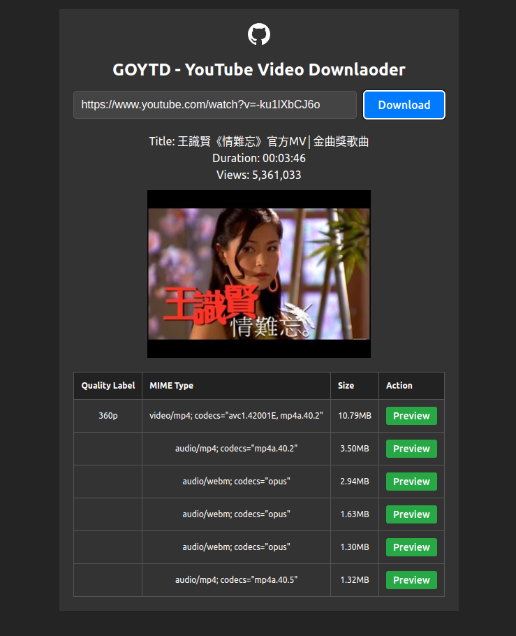

# <p align="center">GOYTD</p>

GOYTD is a simple yet powerful tool designed to make downloading YouTube videos hassle-free, utilizing Web Assembly technology around the [kkdai/youtube](https://github.com/kkdai/youtube) library for video URL extraction.


Visit https://goytd.pages.dev for more information.



<hr />


## Installation
1. Clone the Repository:
    ```bash
    git clone https://github.com/dev6699/goytd.git
    cd goytd
    ```

2. Install Dependencies:
    ```bash
    npm i
    go mod tidy
    ```

3. Start application:
    ```bash
    npm run dev
    npm run pages:dev
    ```
    Open your web browser and go to http://localhost:3000 to access the application.

4. Deployment
    ```bash
      npm run pages:deploy
    ```

## License
This project is licensed under the MIT License - see the [LICENSE](LICENSE) file for details.